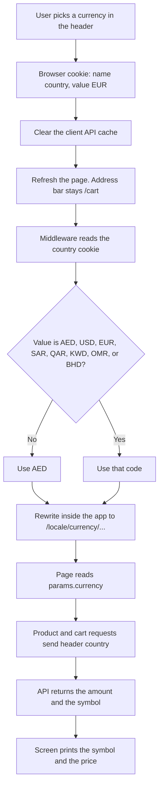

# Currency switching

The site does not convert prices itself. A cookie remembers the chosen currency, middleware maps that choice onto an internal URL, and the API returns amounts already priced in that currency.

## Flow

On the next visit the dropdown step is skipped. Middleware reads the same `country` cookie and runs from there.

In DevTools the cookie is under **Application → Cookies → http://localhost:3000**, row name **`country`**. The preview stays empty until that row is selected.

## Supported currencies

Defined in `src/utils/currency.ts`:

`AED`, `USD`, `EUR`, `SAR`, `QAR`, `KWD`, `OMR`, `BHD`

`AED` is the default. Any other value is treated as `AED`.

## Where the choice is stored

The header dropdown (`src/components/product/CurrencySelect.tsx`) writes a cookie named `country`. It lasts one year.

The public URL stays the same (`/shop`, `/product/...`). The address bar does not show the currency.

## How a request picks a currency

`src/proxy.ts` runs on each page request:

1. Locale middleware handles `en` / `ar`.
2. The `country` cookie is read.
3. The request is rewritten internally to `/{locale}/{currency}/...`, for example `/en/USD/shop`.

Client navigation strips that segment back out (`src/i18n/navigation.ts`), so links stay currency-free.

Pages under `src/app/[locale]/[currency]/` read `params.currency`. The layout is generated once per currency (`generateStaticParams`), so each currency can be cached on its own.

## What happens when the user changes it

`CurrencySelect` does three things:

1. Saves the new code in the `country` cookie.
2. Clears the client API cache (cart, wishlist, and similar), so those requests run again.
3. Refreshes the page so server components render again.

## How prices update

Server fetches in `src/server/index.ts` send the currency as a `country` header (`getHomePage`, `getAllProducts`, `getProduct`, and the rest). Client calls do the same from the cookie (`src/store/api.ts`).

The API answers with amounts already converted, plus a symbol such as `د.إ` or `$` (`pricing_context.currency_symbol`, or `currency_symbol` on the cart). Components only print that symbol next to the number (`src/utils/price.ts`).

Each currency is cached separately, so AED and USD pages do not share the same product data.